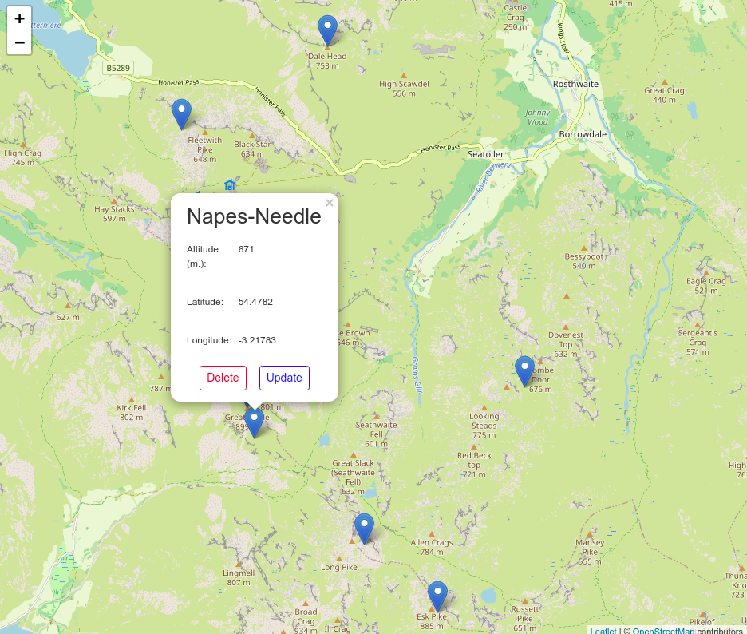
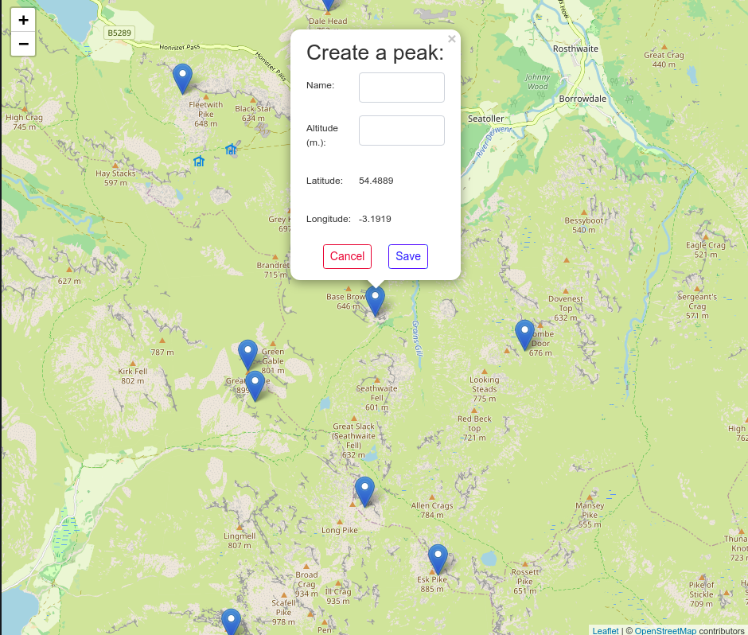

# README

This is a test project, combining the following stacks:

* django / django-rest-frawework / postgres
* React
* Leaflet / React-Leaflet
* docker, docker-compose

## Usage

Use the map from the main page to reveal and read the peaks from the [peak sources github repo](https://github.com/open-peaks/data).

> You may have to pan and zoom in or out of the map.



You may delete or update an existing peak.

By clicking on an empty location in the map, you may  create a new peak. Click on the new markup and fill in the form with a name and an altitude (optional). The click on the "save" button.



## Getting the code

Clone the code from [github](https://github.com/atopus/mfi-test) with its `backend` and `front` submodules, as such:

```
$ git clone https://github.com/atopus/mfi-test.git --recursive
```

## Development

See the respective README.md in the `backend` and `front` submodules.

## Deployment

_Requirements: docker & docker-compose_

As an illustration, let's assume that you want to deploy this application at the following url: peak.mysite.com,

1. In `/front/Dockerfile`, set `REACT_API_HOST` and the `REACT_API_PORT` according to the public url (most probably on port 80). E.g.

    ```dockerfile
    ENV REACT_APP_API_HOST=peak.mysite.com,
    ENV REACT_APP_API_PORT=80
    ```

2. Then, from the project directory, run the docker-compose command as a daemon:

    ```
    $ docker-compose up -d
    ```

3. Eventually, add a proxy-pass towards the `nginx` container.
    
    The application comes with an `nginx` container which takes care of the redirection to the `backend` and the `front` containers, as well as the static files.

    For instance, if an nginx server is used in front of your server, you may use:

    ```
    server {
        listen 80;

        server_name peak.mysite.com;

        access_log /var/log/nginx/peaks.log;
        error_log /var/log/nginx/peaks.log;

        location / {
            proxy_pass http://localhost:8080/;
        }
    }

    ```

> In order to change to the port to anything other than `8080` - for instance to `8091`, please update also the port settings in `docker-compose` to "8081:8080".

## TODO

* [x] Debug the git submodule cloning;
* [x] Build front;
* [ ] Debug the popup when creating a peak: for now, the markup created with a single clic on the map needs to be clicked again ~~twice~~ in order to display the popup;
* [x] Review the peak displaying for improved stability;
* [ ] Add validators and error handling;
* [ ] Add success feedback messages when creating, updating or deleting a peak;
* [ ] Give access to the django admin ;
* [ ] Tag the releases;
* [ ] Show data credits from the map or the popup;
* [ ] Why is `serve` running on port 3000 (expected 5000) ?;
* [ ] Use pure static for front app;

## Contact

paul.antropius@gmail.com
